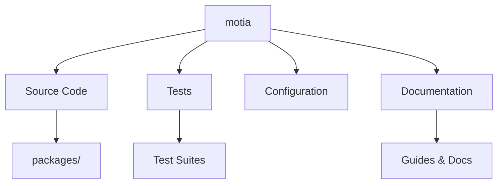

# motia-monorepo - Contributor Guide

> **Auto-generated documentation** to help new contributors understand and contribute to this project.  
> Repository: [`MotiaDev/motia`](https://github.com/MotiaDev/motia)  
> Branch: `main`  
> Generated: 12/1/2025, 7:19:52 PM

---

## 📋 Table of Contents

- [Project Overview](#project-overview)
- [Repository Structure](#repository-structure)
- [Getting Started](#getting-started)
- [Development Workflow](#development-workflow)
- [Architecture Overview](#architecture-overview)
- [Key Directories](#key-directories)
- [Important Files](#important-files)
- [Testing](#testing)
- [Contributing](#contributing)
- [Resources](#resources)

---

## 🎯 Project Overview

### What is motia-monorepo?

motia-monorepo is a comprehensive project with 1452 files organized across 17 main directories.

**Repository Stats:**
- 📁 **Total Files:** 1452
- 💻 **Source Files:** 706
- 🧪 **Test Files:** 55
- 📖 **Documentation:** 100 markdown files
- ⚙️ **Configuration:** 115 files

---

## 📂 Repository Structure

```
motia/
├── CONTRIBUTING.md/
├── LICENSE/
├── MONOREPO-README.md/
├── README.md/
├── assets/
├── biome.json/
├── compose.yml/
├── contributors/
├── eslint.config.js/
├── eslint.config.tsx.js/
├── generate-dockerfile.js/
├── package.json/
├── packages/
├── playground/
├── plugins/
└── ... and 2 more directories
```

---

## 🚀 Getting Started

### Prerequisites

- **Node.js:** v18 or higher recommended
- **Package Manager:** npm, yarn, or pnpm
- **Git:** For cloning and contributing

### Installation

```bash
# 1. Clone the repository
git clone https://github.com/MotiaDev/motia.git

# 2. Navigate to the project
cd motia

# 3. Install dependencies
npm install

# 4. Start development server
npm run dev
# Build the project
npm run build
# Run tests
npm test
```

### Available Scripts

- **`npm run prepare`** - husky || true
- **`npm run dev:docs`** - pnpm -r --filter=docs start
- **`npm run dev`** - pnpm run build && pnpm -r --filter=playground dev
- **`npm run dev:workbench`** - pnpm run build && pnpm -r --filter=playground dev:workbench
- **`npm run build`** - pnpm --filter=!docs run -r build
- **`npm run lint`** - biome check . && pnpm run -r --no-bail lint:plugins
- **`npm run lint:ci`** - biome ci . --since=origin/main --changed --diagnostic-level=error --no-errors-on-unmatched && pnpm run -r --no-bail lint:plugins
- **`npm run lint:fix`** - biome check --write . && pnpm run -r --no-bail lint:plugins --fix
- **`npm run lint:plugins`** - pnpm run -r --no-bail lint:plugins
- **`npm run format`** - biome format --write .
- **`npm run format:check`** - biome check .
- **`npm run test`** - pnpm -r run test
- **`npm run test:e2e`** - pnpm --filter=@motiadev/e2e test
- **`npm run test:e2e:ui`** - pnpm --filter=@motiadev/e2e test:ui
- **`npm run test:e2e:headed`** - pnpm --filter=@motiadev/e2e test:headed
- **`npm run e2e:install`** - pnpm --filter=@motiadev/e2e install && pnpm --filter=@motiadev/e2e install:deps
- **`npm run clean`** - rm -rf node_modules pnpm-lock.yaml dist .turbo .next

---

## 🏗️ Architecture Overview

### Project Type

Based on the repository structure, this appears to be a **Monorepo** project.

### Technology Stack

- **TypeScript** - Type-safe JavaScript
- **JavaScript** - Core language
- **Next.js** - React framework
- **React** - UI library


### Architecture Diagram



---

## 📁 Key Directories

### `CONTRIBUTING.md/`

**CONTRIBUTING.md** - Contains 0 files

- **Files:** 0


---

### `LICENSE/`

**LICENSE** - Contains 0 files

- **Files:** 0


---

### `MONOREPO-README.md/`

**MONOREPO-README.md** - Contains 0 files

- **Files:** 0


---

### `README.md/`

**README.md** - Contains 0 files

- **Files:** 0


---

### `assets/`

**assets** - Contains 70 files

- **Files:** 70


---

### `biome.json/`

**biome.json** - Contains 0 files

- **Files:** 0


---

### `compose.yml/`

**compose.yml** - Contains 0 files

- **Files:** 0


---

### `contributors/`

**contributors** - Contains 14 files

- **Files:** 14

- **Documentation:** 12 files

---

### `eslint.config.js/`

**eslint.config.js** - Contains 0 files

- **Files:** 0


---

### `eslint.config.tsx.js/`

**eslint.config.tsx.js** - Contains 0 files

- **Files:** 0


---

## 📄 Important Files

### Configuration

- **[`.github/ISSUE_TEMPLATE/bug_report.yml`](.github/ISSUE_TEMPLATE/bug_report.yml)** - Configuration file
- **[`.github/ISSUE_TEMPLATE/documentation.yml`](.github/ISSUE_TEMPLATE/documentation.yml)** - Configuration file
- **[`.github/ISSUE_TEMPLATE/feature_request.yml`](.github/ISSUE_TEMPLATE/feature_request.yml)** - Configuration file
- **[`.github/actions/kill-port/action.yml`](.github/actions/kill-port/action.yml)** - Configuration file
- **[`.github/actions/setup/action.yml`](.github/actions/setup/action.yml)** - Configuration file
- **[`.github/deploy-config.yml`](.github/deploy-config.yml)** - Configuration file
- **[`.github/workflows/codeql.yml`](.github/workflows/codeql.yml)** - Configuration file
- **[`.github/workflows/create-tag.yml`](.github/workflows/create-tag.yml)** - Configuration file

### Documentation

- **[`.github/PULL_REQUEST_TEMPLATE.md`](.github/PULL_REQUEST_TEMPLATE.md)** - Documentation
- **[`CONTRIBUTING.md`](CONTRIBUTING.md)** - Contribution guidelines
- **[`MONOREPO-README.md`](MONOREPO-README.md)** - Documentation
- **[`README.md`](README.md)** - Project overview and quick start
- **[`contributors/architecture/deploy/DEPLOY_DIAGRAM.md`](contributors/architecture/deploy/DEPLOY_DIAGRAM.md)** - Documentation
- **[`contributors/architecture/deploy/DEPLOY_FLOW.md`](contributors/architecture/deploy/DEPLOY_FLOW.md)** - Documentation
- **[`contributors/rfc/0000-00-00-template.md`](contributors/rfc/0000-00-00-template.md)** - Documentation
- **[`contributors/rfc/2025-06-02-observability-system.md`](contributors/rfc/2025-06-02-observability-system.md)** - Documentation

---

## 🧪 Testing


This project includes **55 test files**.

### Running Tests

```bash
npm test


```

### Test Files Location

- `packages/core/src/__tests__/call-step-file.test.ts`
- `packages/core/src/__tests__/event-manager.test.ts`
- `packages/core/src/__tests__/flow-endpoint.test.ts`
- `packages/core/src/__tests__/get-config.test.ts`
- `packages/core/src/__tests__/infrastructure-config.test.ts`

- ... and 50 more test files


---

## 🤝 Contributing

### How to Contribute

1. **Fork** the repository
2. **Clone** your fork locally
3. **Create a branch** for your feature: `git checkout -b feature/amazing-feature`
4. **Make your changes** and commit: `git commit -m 'Add amazing feature'`
5. **Push** to your fork: `git push origin feature/amazing-feature`
6. **Open a Pull Request** on GitHub

### Code Style

- Follow ESLint rules defined in the project

- Write type-safe TypeScript code
- Add tests for new features

### Commit Guidelines

- Use clear, descriptive commit messages
- Reference issue numbers when applicable
- Keep commits focused and atomic

---

## 📚 Resources

### Documentation

- [`.github/PULL_REQUEST_TEMPLATE.md`](.github/PULL_REQUEST_TEMPLATE.md)
- [`CONTRIBUTING.md`](CONTRIBUTING.md)
- [`MONOREPO-README.md`](MONOREPO-README.md)
- [`README.md`](README.md)
- [`contributors/architecture/deploy/DEPLOY_DIAGRAM.md`](contributors/architecture/deploy/DEPLOY_DIAGRAM.md)

### Key Links

- **Repository:** https://github.com/MotiaDev/motia
- **Issues:** https://github.com/MotiaDev/motia/issues
- **Pull Requests:** https://github.com/MotiaDev/motia/pulls

---

## 🎓 Understanding the Codebase

### Where to Start

1. **Read the README.md** - Understand what the project does
2. **Check CONTRIBUTING.md** - Learn contribution guidelines  
3. **Explore `CONTRIBUTING.md/`** - Main source code
4. **Review tests** - See how features are tested
5. **Check issues** - Find beginner-friendly tasks

### Common Patterns

- **React Components** - UI building blocks
- **Test-Driven Development** - Tests guide implementation
- **TypeScript** - Static type checking
- **Modular Architecture** - Separated concerns

---

## 💡 Beginner-Friendly Tasks

Looking to make your first contribution? Try:

1. **Documentation improvements** - Fix typos, clarify explanations
2. **Add tests** - Increase test coverage
3. **Fix bugs** - Check the issues labeled "good first issue"
4. **Improve error messages** - Make errors more helpful
5. **Add examples** - Help others learn from real use cases

---

## 📊 Project Statistics

| Metric | Value |
|--------|-------|
| Total Files | 1452 |
| Source Files | 706 |
| Test Files | 55 |
| Documentation | 100 |
| Configuration | 115 |
| Directories | 328 |

---

**Generated by:** Day-3 Auto-Doc Workflow  
**Last Updated:** 12/1/2025, 7:19:52 PM  
**Repository:** [MotiaDev/motia](https://github.com/MotiaDev/motia)

---

*This guide was automatically generated to help new contributors. If you find any issues or have suggestions, please open an issue!*
