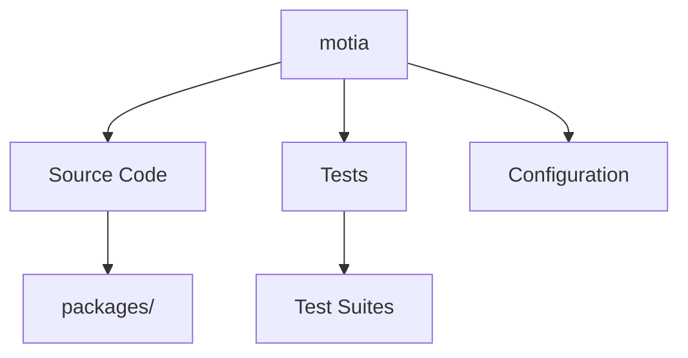

# motia - Contributor Guide

> **Auto-generated documentation** to help new contributors understand and contribute to this project.  
> Repository: [`MotiaDev/motia`](https://github.com/MotiaDev/motia)  
> Branch: `main`  
> Generated: 12/1/2025, 11:32:02 PM

---

## 📋 Table of Contents

- [Project Overview](#project-overview)
- [Repository Structure](#repository-structure)
- [Getting Started](#getting-started)
- [Architecture Overview](#architecture-overview)
- [Key Directories](#key-directories)
- [Important Files](#important-files)
- [Testing](#testing)
- [Contributing](#contributing)

---

## 🎯 Project Overview

### What is motia?

**motia** is a project with 711 files organized across 15 main modules.

**Repository Stats:**
- 📁 **Total Files:** 711
- 🧩 **Modules:** 15
- 🧪 **Test Files:** 62
- ⚙️ **Configuration:** 90
- ⚡ **Workflows:** 14

---

## 📂 Repository Structure

```
motia/
├── CONTRIBUTING.md/
├── MONOREPO-README.md/
├── README.md/
├── biome.json/
├── compose.yml/
├── contributors/
├── eslint.config.js/
├── eslint.config.tsx.js/
├── generate-dockerfile.js/
├── package.json/
├── packages/
├── playground/
├── plugins/
├── pnpm-lock.yaml/
├── pnpm-workspace.yaml/

```

---

## 🚀 Getting Started

### Prerequisites

- **Node.js:** v18 or higher recommended
- **Package Manager:** npm, yarn, or pnpm
- **Git:** For cloning and contributing

### Installation

```bash
# 1. Clone the repository
git clone https://github.com/MotiaDev/motia.git

# 2. Navigate to the project
cd motia

# 3. Install dependencies
npm install

# 4. Start development server
npm run dev
```

---

## 🏗️ Architecture Overview

### Project Type

Based on the repository structure, this appears to be a **Monorepo** project.

### Architecture Diagram



---

## 📁 Key Directories

### `CONTRIBUTING.md/`
- **Module:** CONTRIBUTING.md

### `MONOREPO-README.md/`
- **Module:** MONOREPO-README.md

### `README.md/`
- **Module:** README.md

### `biome.json/`
- **Module:** biome.json

### `compose.yml/`
- **Module:** compose.yml

### `contributors/`
- **Module:** contributors

### `eslint.config.js/`
- **Module:** eslint.config.js

### `eslint.config.tsx.js/`
- **Module:** eslint.config.tsx.js

### `generate-dockerfile.js/`
- **Module:** generate-dockerfile.js

### `package.json/`
- **Module:** package.json


---

## 📄 Important Files

### Configuration
- [`biome.json`](biome.json)
- [`eslint.config.js`](eslint.config.js)
- [`package.json`](package.json)
- [`packages/adapter-rabbitmq-events/package.json`](packages/adapter-rabbitmq-events/package.json)
- [`packages/adapter-rabbitmq-events/tsconfig.json`](packages/adapter-rabbitmq-events/tsconfig.json)
- [`packages/adapter-redis-cron/package.json`](packages/adapter-redis-cron/package.json)
- [`packages/adapter-redis-cron/tsconfig.json`](packages/adapter-redis-cron/tsconfig.json)
- [`packages/adapter-redis-state/package.json`](packages/adapter-redis-state/package.json)
- [`packages/adapter-redis-state/tsconfig.json`](packages/adapter-redis-state/tsconfig.json)
- [`packages/adapter-redis-streams/package.json`](packages/adapter-redis-streams/package.json)

### Workflows
- [`.github/workflows/codeql.yml`](.github/workflows/codeql.yml)
- [`.github/workflows/create-tag.yml`](.github/workflows/create-tag.yml)
- [`.github/workflows/dependency-review.yml`](.github/workflows/dependency-review.yml)
- [`.github/workflows/deploy-motia-docker.yml`](.github/workflows/deploy-motia-docker.yml)
- [`.github/workflows/deploy.yml`](.github/workflows/deploy.yml)

---

## 🧪 Testing

This project includes **62 test files**.

### Test Files Location
- `packages/core/src/__tests__/call-step-file.test.ts`
- `packages/core/src/__tests__/event-manager.test.ts`
- `packages/core/src/__tests__/fixtures/event-fixtures.ts`
- `packages/core/src/__tests__/fixtures/step-fixtures.ts`
- `packages/core/src/__tests__/flow-endpoint.test.ts`

---

## 🤝 Contributing

1. **Fork** the repository
2. **Clone** your fork locally
3. **Create a branch** for your feature
4. **Make your changes** and commit
5. **Push** to your fork
6. **Open a Pull Request**

---

**Generated by:** Motia Auto-Doc Workflow  
**Repository:** [MotiaDev/motia](https://github.com/MotiaDev/motia)

*This guide was automatically generated. If you find any issues, please open an issue!*

Thanks for watching!