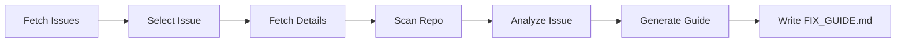

# Day-4 — AI Issue Explainer & Fix-Guide Generator

This workflow helps any contributor understand **what to fix**, **where to fix**, and **how to fix** by analyzing a single chosen GitHub issue.

## 🎯 What It Does

Leverages AI to transform complex GitHub issues into beginner-friendly fix guides by:
- Fetching open issues from your repository
- Allowing selection of a specific issue
- Analyzing the issue context with AI
- Scanning relevant repository files
- Generating a comprehensive `FIX_GUIDE.md` with actionable steps

## 🌊 Workflow



## 📋 Steps

1. **Fetch Open Issues** - Get list of all open issues
2. **Select Issue** - User picks one via API
3. **Fetch Details** - Get full issue description 
4. **Scan Repository** - Analyze relevant code files
5. **AI Analysis** - LLM identifies root cause and affected files
6. **Generate Fix Guide** - Create comprehensive markdown guide
7. **Write to Disk** - Save as `FIX_GUIDE.md`

## 🚀 Setup

1. Install dependencies:
```bash
npm install
```

2. Configure environment variables:
```bash
cp .env.example .env
# Edit .env with your credentials
```

3. Start the development server:
```bash
npm run dev
```

## 🔧 API Endpoints

### GET /issues
Fetch all open issues from the configured repository.

**Response:**
```json
[
  {
    "id": 123,
    "number": 45,
    "title": "Bug: Login fails on mobile"
  }
]
```

### POST /pick-issue
Select an issue to analyze and generate a fix guide.

**Request:**
```json
{
  "issueNumber": 45
}
```

**Result:** Triggers the workflow and generates `FIX_GUIDE.md`

## 📄 Generated Output

The workflow produces a `FIX_GUIDE.md` file containing:

- **Summary** - Brief overview of the issue
- **Problem** - Detailed problem description
- **Root Cause** - AI-identified cause
- **Files to Check** - Relevant source files
- **Functions to Inspect** - Specific functions/methods
- **How to Fix** - Step-by-step fix instructions
- **Suggested Patch** - Optional code snippet
- **Difficulty** - Rated as Easy/Medium/Hard
- **Beginner Friendly** - Boolean indicator

## 🏗️ Architecture

Built with Motia following Domain-Driven Design:

```
Day-4/
├── src/
│   ├── services/       # Domain services
│   │   ├── github/     # GitHub API integration
│   │   ├── llm/        # OpenAI integration
│   │   └── filesystem/ # File operations
│   ├── errors/         # Custom error classes
│   └── middlewares/    # Error handling
└── steps/              # Motia workflow steps
    └── issue-explain/  # 7 interconnected steps
```

## 🔐 Environment Variables

- `GITHUB_TOKEN` - GitHub Personal Access Token
- `GITHUB_OWNER` - Repository owner/organization
- `GITHUB_REPO` - Repository name
- `GITHUB_BRANCH` - Branch to analyze (default: main)
- `OPENAI_API_KEY` - OpenAI API key
- `OUTPUT_PATH` - Path for generated guide (default: ./FIX_GUIDE.md)

## 📝 Example Usage

```bash
# Start the server
npm run dev

# In another terminal, fetch issues
curl http://localhost:3000/issues

# Pick an issue to analyze
curl -X POST http://localhost:3000/pick-issue \
  -H "Content-Type: application/json" \
  -d '{"issueNumber": 45}'

# Wait for processing...
# Check the generated guide
cat FIX_GUIDE.md
```

## 🎓 For Contributors

This workflow is designed to help new contributors by:
- Breaking down complex issues into digestible parts
- Identifying exactly which files need attention
- Providing context about the codebase structure
- Offering step-by-step guidance
- Rating difficulty to help match issues with skill level

---

**Built with Motia** - Event-driven workflow automation framework
